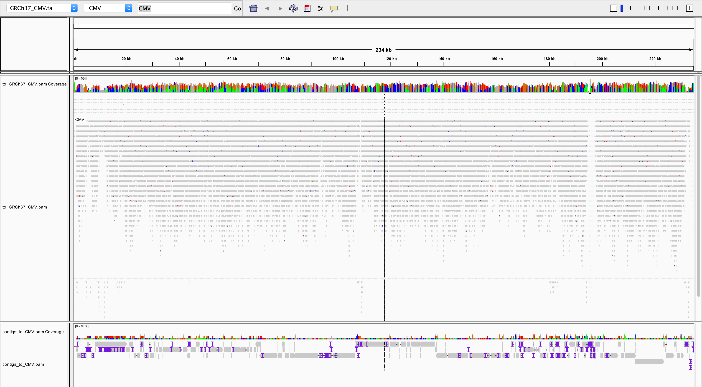

# Oncoviruses in APGI Garvan KRAS-wt, sample PRJ180143_3371-8073336T <!-- omit in toc --> 

- [Normal sample](#normal-sample)
- [Searching for integrating viruses](#searching-for-integrating-viruses)
    - [Viral content](#viral-content)
    - [Bridging reads in virus](#bridging-reads-in-virus)
    - [Integration sites](#integration-sites)
- [Conclusion](#conclusion)
- [Assembly](#assembly)

Sample `PRJ180143_3371-8073336T` was reported by bcbio to have a high CMV content in bcbio.

Bcbio run on Spartan: `/data/cephfs/punim0010/data/Results_Transient/Research-APGI-Garvan-KRAS-wt/2018-08-25/final/PRJ180143_3371-8073336T`

Viral report is `qc/viral/PRJ180143_3371-8073336T-gdc-viral-completeness.txt`:

[Trello card](https://trello.com/c/dMPPUSgs/226-3371).

```
#virus        size  depth  1x          5x         
CMV         235646  70.16  0.984379    0.964162   
HCV-1         9646  1.17   0.0096413   0.00943396 
HCV-2         9711  1.00   0.00978272  0.00926784 
SV40          5243  0.00   0           0          
MCV           5387  0.00   0           0          
KSHV        137969  0.00   0           0          
HTLV-1        8507  0.00   0           0          
HPV99         7698  0.00   0           0          
HPV98         7466  0.00   0           0          
HPV71         8037  0.00   0           0          
```

Since bcbio didn't report viral stats for normal samples at the moment, we are going to do that manually.

Then we'll check for integration sites it tumor.

Set up (on spratan):

```
conda activate viral  # samtools sambamba bwa minimap2 biobambam mosdepth
cd /data/cephfs/punim0010/projects/Saveliev_Viral/APGI-Garvan-KRAS-wt
```


## Normal sample

```
ORI_BAM=PRJ180144_3371-8073337N-ready.bam
PFX=PRJ180144_3371-8073337N

samtools view -u -f4 $ORI_BAM | bamtofastq collate=0 | bwa mem -t 30 human_plus_viral_genome/gdc-viral - | bamsort inputthreads=30 outputthreads=30 inputformat=sam index=1 indexfilename=$PFX.to_gdc.bam.bai O=$PFX.to_gdc.bam

bash check_cov.sh $PFX.to_gdc.bam
tsv $PFX.to_gdc-completeness.txt

virus       size    reads  depth  1x          5x          25x
HCV-2       9711    57     0.38   0.00947379  0.0081351   0
HCV-1       9646    73     0.40   0.0096413   0.00663487  0
SV40        5243    0      0.00   0           0           0
MCV         5387    0      0.00   0           0           0
...
CMV         235646  11     0.01   0           0           0
```

No viral content in normal.

To double check, same for the tumor:

```
ORI_BAM=PRJ180143_3371-8073336T-ready.bam
PFX=PRJ180143_3371-8073336T

samtools view -u -f4 $ORI_BAM | bamtofastq collate=0 | bwa mem -t 30 human_plus_viral_genome/gdc-viral - | bamsort inputthreads=30 outputthreads=30 inputformat=sam index=1 indexfilename=$PFX.to_gdc.bam.bai O=$PFX.to_gdc.bam

bash check_cov.sh $PFX.to_gdc.bam
tsv $PFX.to_gdc-completeness.txt

virus       size    reads   depth  1x          5x          25x
CMV         235646  111909  70.16  0.984379    0.964162    0
HCV-1       9646    215     1.17   0.0096413   0.00943396  0
HCV-2       9711    151     1.00   0.00978272  0.00926784  0
```

Yes, only tumor has CMV content.


## Searching for integrating viruses

Although CMV is not confirmed to integrate into the human genome, we will explore if that happened in this sample.

```
ORI_BAM=PRJ180143_3371-8073336T-ready.bam
PFX=PRJ180143_3371-8073336T
```

### Viral content

Extracting all unmapped reads, as well as mapped reads with unmapped mate, that could confirm integration:

```
# extract
sambamba view -f bam -F "unmapped or mate_is_unmapped" -t 30 $ORI_BAM | samtools sort -n -@ 30 > $PFX.unmapped_or_mate.bam
 
TODO: down from here - retry filter_bam_good_unmapped_or_mate.py that now keeps both mates unmapped. Should keep CMV.

# filter out bad fastq and alignments
./filter_bam_good_unmapped_or_mate.py $PFX.unmapped_or_mate.bam $PFX.unmapped_or_mate.lng_hqual.bam

# convert to paired fastq
samtools fastq $PFX.unmapped_or_mate.lng_hqual.bam -1 $PFX.unmapped_or_mate.R1.fq -2 $PFX.unmapped_or_mate.R2.fq -s $PFX.unmapped_or_mate.single.fq
```

Getting reads mapping to the GDC database of oncoviral sequences:

```
mkdir ${PFX}_viral_mapping
bwa mem -t 30 human_plus_viral_genome/gdc-viral $PFX.unmapped_or_mate.R1.fq $PFX.unmapped_or_mate.R2.fq | bamsort inputthreads=30 outputthreads=30 inputformat=sam index=1 indexfilename=${PFX}_viral_mapping/to_gdc.bam.bai O=${PFX}_viral_mapping/to_gdc.bam
```

Viewing read mapping statistics:

```
bash check_cov.sh ${PFX}_viral_mapping/to_gdc.bam
tsv viral_mapping/${PFX}_to_gdc-completeness.txt
virus       size    reads   depth  1x          5x          25x
CMV         235646  111123  69.38  0.98673     0.966276    0
HPV19       7685    50      0.33   0.00845804  0.00754717  0
HPV71       8037    275     1.32   0.00808759  0.0070922   0
HCV-1       9646    27      0.11   0.00912295  0           0
HCV-2       9711    26      0.14   0.00906189  0           0
HPV82       7870    21      0.10   0.00482846  0           0
```

CMV has high support, with almost complete genome coverage above 5x. 


### Bridging reads in virus

Now checking if CMV integrates. Integrating virus should have a high content of unmapped reads in the last column in its `samtools idxstats` record, because those are the unmapped reads have mates mapped to CMV, and thus bridge the viral and human genome.

In order to do that, realigning all candidate reads to CMV only, and counting reads unmapped  pairs bridging human and virus:

```
VIRUS=CMV
cd ${PFX}_viral_mapping

# get the virus sequence
samtools faidx ../human_plus_viral_genome/gdc-viral.fa $VIRUS > $VIRUS.fa
bwa index $VIRUS.fa

# align to the virus
bwa mem -t 30 $VIRUS.fa ../$PFX.unmapped_or_mate.R1.fq ../$PFX.unmapped_or_mate.R2.fq | bamsort inputthreads=30 outputthreads=30 inputformat=sam index=1 indexfilename=to_$VIRUS.bam.bai O=to_$VIRUS.bam

# Getting reads mapping to the virus and their mates:
samtools view to_$VIRUS.bam $VIRUS -o to_$VIRUS.mapped_or_mate.bam

# Checking coverage stats
samtools idxstats to_$VIRUS.mapped_or_mate.bam
CMV     235646  111123  847
*       0       0       0
```

847 out of 111123 suggest integration. 

Now extracting only bridging reads (one mate maps to human, another unmapped) from the human genome:

```
./filter_bam_bridging_reads.py $PFX.unmapped_or_mate.lng_hqual.bam $PFX.unmapped_or_mate.lng_hqual.bridging.bam
samtools fastq $PFX.unmapped_or_mate.lng_hqual.bridging.bam -1 $PFX.unmapped_or_mate.lng_hqual.bridging.R1.fq -2 $PFX.unmapped_or_mate.lng_hqual.bridging.R2.fq -s $PFX.unmapped_or_mate.lng_hqual.bridging.single.fa
bwa mem -t 30 human_plus_viral_genome/gdc-viral $PFX.unmapped_or_mate.lng_hqual.bridging.R2.fq $PFX.unmapped_or_mate.lng_hqual.bridging.R2.fq | bamsort inputthreads=30 outputthreads=30 inputformat=sam index=1 indexfilename=$PFX.unmapped_or_mate.lng_hqual.bridging.gdc.bam.bai O=$PFX.unmapped_or_mate.lng_hqual.bridging.gdc.bam
bash check_cov.sh $PFX.unmapped_or_mate.lng_hqual.bridging.gdc.bam
virus       size    reads  depth  1x          5x          25x
CMV         235646  4      0.00   0           0           0
```

CMV is not supported by those at all.


### Integration sites

But still making a human+CMV artificial genome to confirm.

```
cat /data/cephfs/punim0010/local/development/bcbio/genomes/Hsapiens/GRCh37/seq/GRCh37.fa > GRCh37_$VIRUS.fa
cat $VIRUS.fa >> GRCh37_$VIRUS.fa
bwa index GRCh37_$VIRUS.fa
bwa mem -t 10 GRCh37_$VIRUS.fa to_$VIRUS.mapped_or_mate.R1.fq to_$VIRUS.mapped_or_mate.R2.fq | bamsort inputthreads=10 outputthreads=10 inputformat=sam index=1 indexfilename=to_GRCh37_$VIRUS.bam.bai O=to_GRCh37_$VIRUS.bam
```

Viewing it in IGV and groupping reads by the chromosome of mate doesn't show any sign of integration - all unmapped mates are really unmapped (might be viral strain differences with novel insertions):




## Conclusion

So as we see, CMV is not supported by mapped reads at all, thus do not integrate (and no evidence of its integration is known in literature, so that's no unexpected).

However, the virus is present in tumor and is missing in normal, which suggest some oncogenetic activity of the virus.


## Assembly

We can still explore the virus. For example, we can do de novo assembly to see if those unmapped reads will bring to anything:

```
samtools sort -n to_$VIRUS.mapped_or_mate.bam -O bam -o to_$VIRUS.mapped_or_mate.namesorted.bam
samtools fastq to_$VIRUS.mapped_or_mate.namesorted.bam -1 to_$VIRUS.mapped_or_mate.R1.fq -2 to_$VIRUS.mapped_or_mate.R2.fq -s 
to_$VIRUS.mapped_or_mate.single.fq

spades.py --only-assembler -1 to_$VIRUS.mapped_or_mate.R1.fq -2 to_$VIRUS.mapped_or_mate.R2.fq -s to_$VIRUS.mapped_or_mate.single.fq -o spades
# QC the assembly - stats and alignment back to the virus

quast.py spades/contigs.fasta -R $VIRUS.fa -o spades/quast --ref-bam to_$VIRUS.mapped_or_mate.namesorted.bam --no-read-stats --no-sv -1 to_$VIRUS.mapped_or_mate.R1.fq -2 to_$VIRUS.mapped_or_mate.R2.fq --debug

minimap2 -a $VIRUS.fa spades/contigs.fasta | samtools sort > spades/contigs_to_$VIRUS.bam && samtools index spades/contigs_to_$VIRUS.bam
```

Assembly is quite fragmented: 117 contigs, covering 93% of the genome, NGA50 of 3231bp. See IGV screenshot above.


## Playground <!-- omit in toc --> 

### Replicating bcbio viral analysis <!-- omit in toc --> 

Sample `PRJ180143_3371-8073336T` was reported by bcbio to have a high CMV content in bcbio.

Bcbio run on Spartan: `/data/cephfs/punim0010/data/Results_Transient/Research-APGI-Garvan-KRAS-wt/2018-08-25/PRJ180143_3371-8073336T`

Viral report is `qc/viral/PRJ180143_3371-8073336T-gdc-viral-completeness.txt`:

```
#virus        size  depth  1x          5x         
CMV         235646  70.16  0.984379    0.964162   
HCV-1         9646  1.17   0.0096413   0.00943396 
HCV-2         9711  1.00   0.00978272  0.00926784 
SV40          5243  0.00   0           0          
MCV           5387  0.00   0           0          
KSHV        137969  0.00   0           0          
HTLV-1        8507  0.00   0           0          
HPV99         7698  0.00   0           0          
HPV98         7466  0.00   0           0          
HPV71         8037  0.00   0           0          
```

When doing integration, we by mistake saw a high % of support of HPV71. Later it was evident that the coverage completeness of it was very low (just 1%), and all reads supporting it just are partial alignment.

Nevertheless, we explored in detail bcbio viral QC check process.

In bcbio stats HPV71 has 0 support - in `qc/viral/PRJ180143_3371-8073336T-gdc-viral-completeness.txt`:

```
#virus        size  depth  1x          5x         
CMV         235646  70.16  0.984379    0.964162   
HCV-1         9646  1.17   0.0096413   0.00943396 
HCV-2         9711  1.00   0.00978272  0.00926784 
SV40          5243  0.00   0           0          
...
HPV71         8037  0.00   0           0         
...
```

Reproducing bcbio viral analysis. Grepping in commands logs:

```
cat grep /data/cephfs/punim0010/data/Results_Transient/Research-APGI-Garvan-KRAS-wt/2018-08-25/final/2018-08-25_2018-08-13T0542_Research-APGI-Garvan-KRAS-wt_WGS-merged/  bcbio-nextgen-commands.log | grep viral | grep PRJ180143_3371-8073336T
```

The first command extracts unmapped reads, and re-maps them (in unpaired way) to the GDC database:

```
samtools view -u -f 4 /data/cephfs/punim0010/projects/Grimmond_kras/2018-08-13T0542_Research-APGI-Garvan-KRAS-wt_WGS-merged/work/align/PRJ180143_3371-8073336T/PRJ180143_3371-8073336T-sort.bam | bamtofastq collate=0 | bwa mem -t 32 /data/cephfs/punim0010/local/development/bcbio/genomes/Hsapiens/GRCh37/viral/gdc-viral.fa - | bamsort tmpfile=/data/cephfs/punim0010/projects/Grimmond_kras/2018-08-13T0542_Research-APGI-Garvan-KRAS-wt_WGS-merged/work/bcbiotx/tmpS1b8_o/PRJ180143_3371-8073336T-gdc-viral-tmp inputthreads=32 outputthreads=32 inputformat=sam index=1 indexfilename=/data/cephfs/punim0010/projects/Grimmond_kras/2018-08-13T0542_Research-APGI-Garvan-KRAS-wt_WGS-merged/work/bcbiotx/tmpS1b8_o/PRJ180143_3371-8073336T-gdc-viral.bam.bai O=/data/cephfs/punim0010/projects/Grimmond_kras/2018-08-13T0542_Research-APGI-Garvan-KRAS-wt_WGS-merged/work/bcbiotx/tmpS1b8_o/PRJ180143_3371-8073336T-gdc-viral.bam
```

Looking at that GDC-aligned BAM:

```
samtools idxstats /data/cephfs/punim0010/projects/Grimmond_kras/2018-08-13T0542_Research-APGI-Garvan-KRAS-wt_WGS-merged/work/qc/PRJ180143_3371-8073336T/viral/PRJ180143_3371-8073336T-gdc-viral.bam | less
CMV     235646  111909  0
...
HPV71   8037    0       0
...
```

This BAM is missing all reads from HPV71, as we see in the report.

So HPV71 reads might be hiding in mapped reads with unmapped mates. Seeing if that's the case. Extracting mapped reads with unmapped mates:

```
sambamba view -f bam -F "not unmapped and mate_is_unmapped" -t 30 unmapped_or_mate.namesorted.bam | samtools sort -n -@ 30 > mapped_and_mate_unmapped.bam
# 4.099.030 reads (= 11.351.077 unmapped_or_mate_unmapped minus 7.252.047 unmapped)
```

Mapping in unpaired fashion like bcbio does, because we want to use all reads for the alignment:

```
samtools view -u mapped_and_mate_unmapped.bam | bamtofastq collate=0 | bwa mem -t 30 ../human_plus_viral_genome/gdc-viral - | bamsort inputthreads=30 outputthreads=30 inputformat=sam index=1 indexfilename=mapped_and_mate_unmapped.to_gdc.bam.bai O=mapped_and_mate_unmapped.to_gdc.bam
samtools idxstats mapped_and_mate_unmapped.to_gdc.bam | awk 'BEGIN {OFS="\t"} {print $1, $2, $3, ($2 != 0) ? $3/$2*150 : 0 }' | sort -nr -k4,4 | tsv
HPV71         8037  6777  126.484
HCV-2         9711  1843  28.4677
HCV-1         9646  1569  24.3987
HPV19         7685   694  13.5459
HPV82         7870   522  9.94917
HPV20         7757   160  3.09398
HPV21         7779   139  2.68029
HPV25         7713   126  2.45041
HPV14         7713    79  1.53637
HPV152        7480    27  0.541444
HPV77         7887    15  0.28528
HPV83         8104    15  0.277641
HPV16         7906    10  0.189729
HPV6          7996    10  0.187594
HPV72         7989     9  0.168982
HPV9          7434     8  0.161421
HPV118        7597     8  0.157957
HPV12         7673     6  0.117294
HPV-mKN1      7300     4  0.0821918
HPV74         7887     4  0.0760746
HPV29         7916     4  0.0757959
HPV73         7700     2  0.038961
HPV143        7715     2  0.0388853
HPV62         8092     2  0.0370737
CMV         235646    47  0.0299178
KSHV        137969    20  0.021744
HPV107        7562     1  0.019836
HPV31         7912     1  0.0189585
```

This is weird, but those mapped reads with unmapped mate support HPV71 very strongly. Also, we clearly see that CMV does not integrate.

Running mosdepth to check HPV71 coverage completeness:

```
BAM=mapped_and_mate_unmapped.to_gdc.bam
PFX=mapped_and_mate_unmapped.to_gdc

mosdepth -t 32 $PFX $BAM -n --thresholds 1,5,25 --by <(awk 'BEGIN {FS="\t"}; {print $1 FS "0" FS $2}' /data/cephfs/punim0010/local/development/bcbio/genomes/Hsapiens/GRCh37/viral/gdc-viral.fa.fai) 
echo '#virus size    depth   1x      5x      25x' >> $PFX-completeness.txt && paste <(zcat $PFX.regions.bed.gz) <(zgrep -v ^# $PFX.thresholds.bed.gz) | awk 'BEGIN {FS="\t"} { print $1 FS $3 FS $4 FS $10/$3 FS $11/$3 FS $12/$3}' | sort -n -r -k 5,5 >> $PFX-completeness.txt
tsv $PFX-completeness.txt
#virus        size  depth  1x           5x           25x
HCV-1         9646  7.10   0.0126477    0.012233     0
HCV-2         9711  10.73  0.0106065    0.00998867   0
HPV71         8037  31.40  0.0110738    0.00958069   0
HPV19         7685  4.02   0.00949902   0.00858816   0
HPV82         7870  2.30   0.00864041   0.00736976   0
HPV20         7757  0.91   0.00837953   0.00721929   0
HPV25         7713  0.64   0.00713082   0.00674186   0
HPV21         7779  0.72   0.00758452   0.00629901   0
HPV14         7713  0.42   0.00726047   0.00596396   0
HPV152        7480  0.12   0.00494652   0.00374332   0
CMV         235646  0.03   0.000997259  0.000564406  0
```

Apparently those 6777 reads cover only 1% of the viral genome, at 31x coverage. So we were correct to filter reads by alignment length with `filter_bam_good_discordant_mates.py `. And bcbio is right to run mosdepth and filter by coverage completeness. Also, it's fine to check only mapped reads in bcbio: it's enough for general QC check. For integration exploration,  you'll need to add mapped reads with unmapped mates. Probably, can add that into bcbio in the future and add 1 extra metric reporting the integration support % (and also since we know which viruses integrate in nature, we can add this into the report as well).