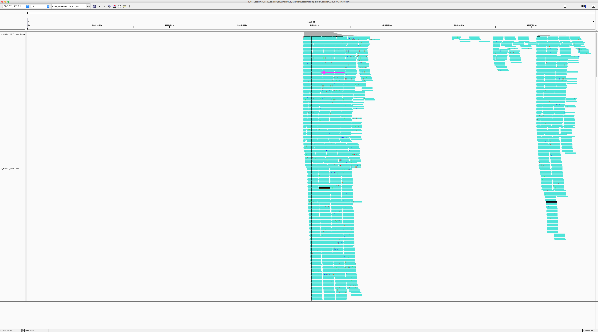
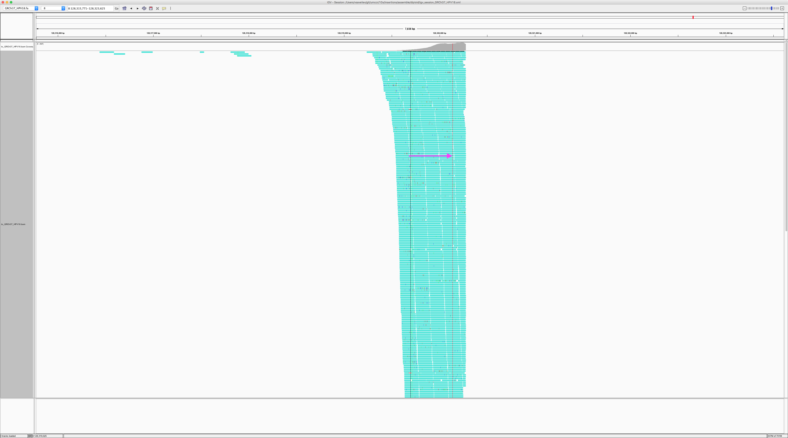
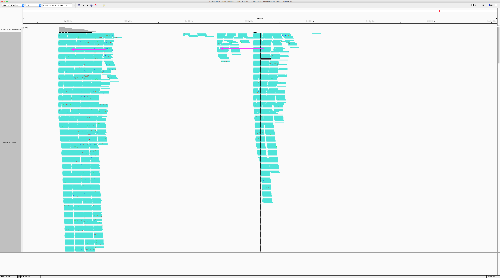
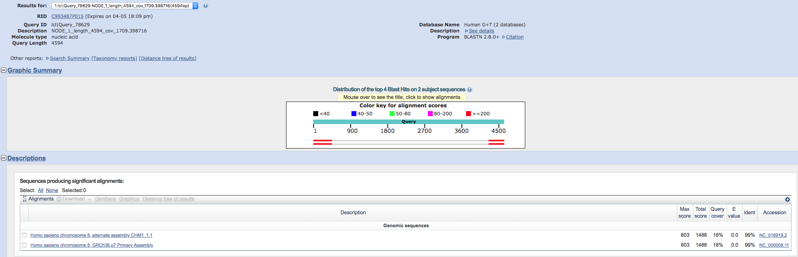
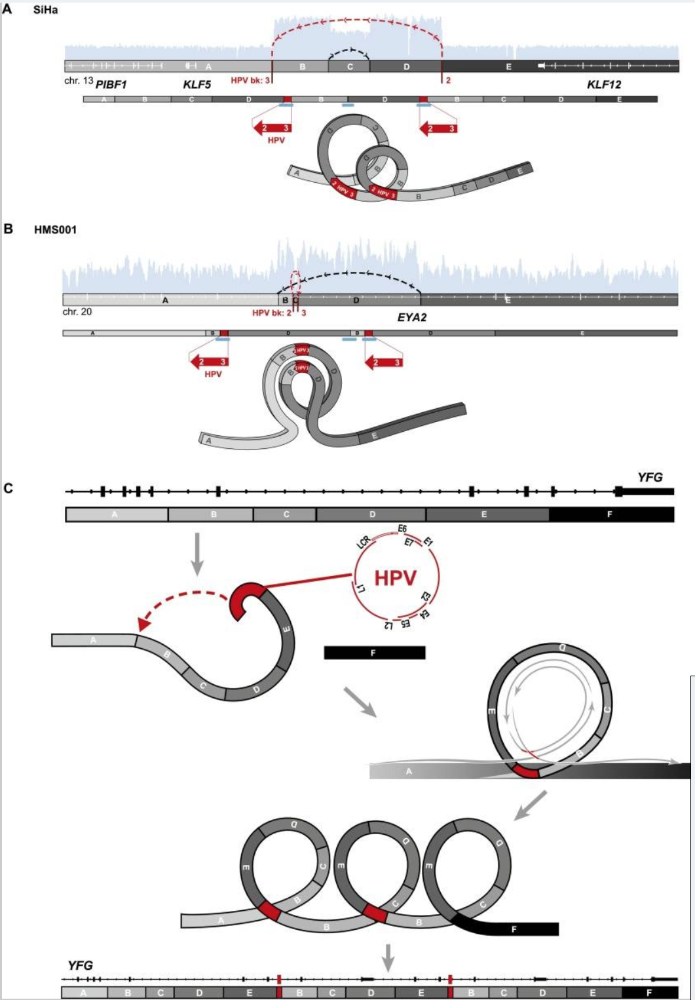
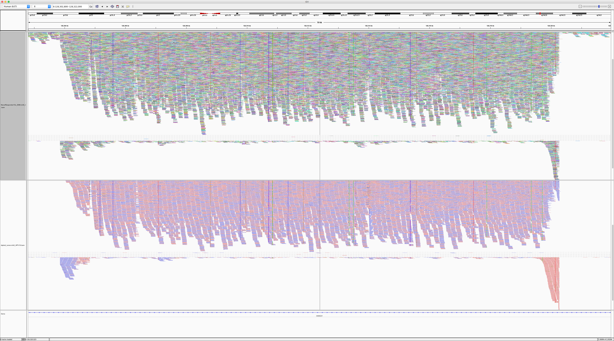
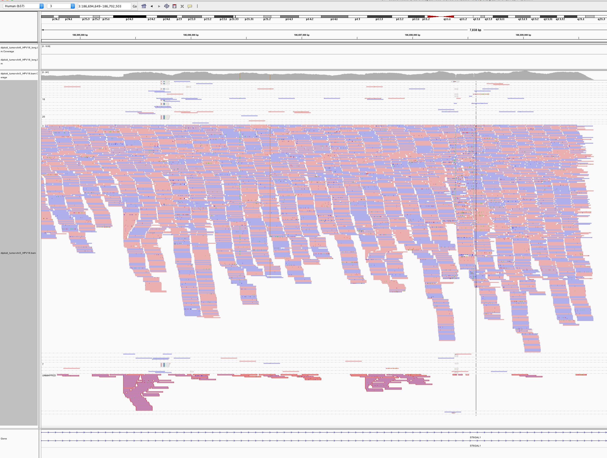

# Oncoviruses in DiploidNeverResponder

Some insertions in human samples cannot be reconstructed by the read alignment to human genome reference, because they have an external origin. For example, [oncoviruses](https://en.wikipedia.org/wiki/Oncovirus) that often cause malignancies by integrating into a human genome. Here, we explore such novel insertions in a [DiploidNeverResponder](https://trello.com/c/4gdQ4Tmi/65-diploid-never-responder) sample sequenced in UMCCR, and see if we can reconstruct their sequences and locate their integration sites. Authors: Vlad Saveliev and Arthur Hsu.

### Contents

* [Extracting unmapped reads](#extracting-unmapped-reads)
* [Exploring taxonomic content](#exploring-taxonomic-content)
  + [Mash](#mash)
  + [BWA-MEM](#bwa-mem)
* [De-novo assembling HPV18](#de-novo-assembling-hpv18-region)
* [Looking for integration sites](#looking-for-integration-sites)
* [chr8 integration site](#chr8-integration-site)
  + [Host genes](#host-genes)
  + [HPV oncogenes](#hpv-oncogenes)
* [10x COLO829](#10x-colo829)


## Extracting unmapped reads

Reads from novel insertions are expected to end up as "unmapped" in a human genome BAM file. So we start the analysis with getting reads unmapped to the human genome, as well as the reads unmapped mates which can support integration breakpoints.

```
sambamba view -f bam -F "unmapped or mate_is_unmapped" -t 20 diploid_tumor-ready.bam | samtools sort -n -@ 10 > diploid_tumor-unmapped_or_mate.namesorted.bam
```

Then we filter high quality reads:
- all(q >= 10 for q in read.query_qualities) and mean(read.query_qualities) >= 25
- read.query_length >= 125
- paired

```
./filter_unmapped_bam.py diploid_tumor-unmapped_or_mate.namesorted.bam
Total:              28,564,510 out of 2,230,924,710
lng_i:              27,894,774
hqual_i:            15,326,411
lng_hqual_i:        14,878,067
paired_i:           28,564,510
paired_lng_hqual_i: 14,878,067
```

Output written to `lng_hqual/diploid_tumor-unmapped_or_mate.namesorted.bam`. Extracting reads:

```
cd lng_hqual
samtools fastq diploid_tumor-unmapped_or_mate.namesorted.bam -1 diploid_tumor.R1.fq -2 diploid_tumor.R2.fq -s diploid_tumor.single.fq
[M::bam2fq_mainloop] discarded 11217916 singletons
[M::bam2fq_mainloop] processed 14878054 reads
```


## Exploring taxonomic content

Querying the target reads against the oncovirus database. First using a fast k-mer approach to give a quick outline, then using exact BWA-MEM alignment to get reads aligned to particular species.

### Mash vs GDC-viral

Applying a fast [k-mer based approach](http://mash.readthedocs.io/en/latest/tutorials.html?highlight=screen#screening-a-read-set-for-containment-of-refseq-genomes). First, querying against a oncoviral database from GDC:

```
mkdir mash
mash sketch /g/data3/gx8/extras/vlad/bcbio/genomes/Hsapiens/GRCh37/viral/gdc-viral.fa -i -o mash/gdc-viral
mash screen mash/gdc-viral.msh diploid_tumor.R1.fq diploid_tumor.R2.fq | sort -gr > mash/screen_gdc.tab
head mash/screen_gdc.tab

0.99726   944/1000   100  0             HPV18
0.879223  67/1000     49  4.56495e-199  HPV45
0.876649  63/1000     29  1.50084e-185  HPV97
0.835578  23/1000      5  1.51569e-58   HPV59
0.816057  14/1000     91  3.39476e-33   HPV68
0.816057  14/1000      6  3.39476e-33   HPV85
0.816057  14/1000   3712  3.39476e-33   HPV39
0.816057  14/1000      2  3.39476e-33   HPV20
0.806739  11/1000      4  3.07798e-25   HPV70
0.806739  11/1000      4  3.07798e-25   HPV66
```

HPV18 is an obvious candidate. Querying against a full RefSeq just in case:

```
mash screen mash/refseq.genomes.k21s1000.msh diploid_tumor.R1.fq diploid_tumor.R2.fq | sort -gr > mash/screen_refseq.tab
(took 4:14.57 time with 100% CPU total)

0.996652  932/1000  98  0             GCF_000865665.1_ViralProj15506_genomic.fna.gz   NC_001357.1 Human papillomavirus - 18, complete genome
0.97558   595/1000   1  0             GCF_000819615.1_ViralProj14015_genomic.fna.gz   NC_001422.1 Enterobacteria phage phiX174 sensu lato, complete genome
0.932215  229/1000   1  0             GCF_000913595.1_ViralProj222261_genomic.fna.gz  NC_022518.1 Human endogenous retrovirus K113 complete genome
0.916976  162/1000   2  0             GCF_000287295.1_ASM28729v1_genomic.fna.gz       NC_018417.1 Candidatus Carsonella ruddii HT isolate Thao2000, complete genome
0.887203  81/1000    2  3.28623e-247  GCF_000829155.1_ASM82915v1_genomic.fna.gz       NZ_AP013293.1 Candidatus Sulcia muelleri PSPU DNA, complete genome
```

Confirmed HPV18.


### BWA-MEM vs GDC-viral

First aligning to the GDC oncoviruses fasta:

```
mkdir viral_mapping
bwa mem -t 10 /g/data3/gx8/extras/vlad/bcbio/genomes/Hsapiens/GRCh37/viral/gdc-viral.fa diploid_tumor.R1.fq diploid_tumor.R2.fq | bamsort inputthreads=10 outputthreads=10 inputformat=sam index=1 indexfilename=viral_mapping/diploid_tumor_viral.bam.bai O=viral_mapping/diploid_tumor_viral.bam
[main] Real time: 38.855 sec; CPU: 333.034 sec
[V] wrote 3666269 alignments

samtools idxstats viral_mapping/diploid_tumor_viral.bam | awk 'BEGIN {OFS="\t"} {print $1, $2, $3, ($2 != 0) ? $3/$2*150 : 0 }' | sort -nr -k4,4 | head | cols

                      completeness at coverage
name    len  ave cov  1x    5x    25x
HPV18  7857  2265.23  1     1     0.93
HCV-1  9646  1.93     0.01  0.01  0.01
HCV-2  9711  2.68     0.01  0.01  0.01
HPV71  8037  7.78     0.01  0.01  0.01
HPV19  7685  1.02     0.01  0.01  0.01
HPV82  7870  0.66     0.01  0.01  0.00
HPV20  7757  0.18     0.01  0.01  0.00
HPV21  7779  0.22     0.01  0.01  0.00
HPV25  7713  0.11     0.01  0.01  0.00
HPV14  7713  0.05     0.01  0.00  0.00
```

HPV18 has an extremely high coverage. Aligning to HPV18 only to make sure none of the related virus didn't hijacked any reads:

```
samtools faidx /g/data3/gx8/extras/vlad/bcbio/genomes/Hsapiens/GRCh37/viral/gdc-viral.fa HPV18 > viral_mapping/HPV18.fa
bwa index viral_mapping/HPV18.fa

bwa mem -t 10 viral_mapping/HPV18.fa diploid_tumor.R1.fq diploid_tumor.R2.fq | bamsort inputthreads=10 outputthreads=10 inputformat=sam index=1 indexfilename=viral_mapping/to_HPV18.bam.bai O=viral_mapping/to_HPV18.bam

samtools idxstats viral_mapping/to_HPV18.bam | awk 'BEGIN {OFS="\t"} {print $1, $2, $3, ($2 != 0) ? $3/$2*150 : 0 }'
# HPV18   7857    151271  2888
```

Getting same coverage.


## De-novo assembling HPV18 region

Getting reads that map to HPV18 and all their mate that might point us to an integration site:

```
cd /g/data3/gx8/projects/Saveliev_Diploid/lng_hqual/viral_mapping

sambamba view -F "not unmapped or not mate_is_unmapped" -f bam -o to_HPV18.mapped_or_mate.bam to_HPV18.bam
# will fail with segmentation fault, however will generate the output. Alternative option is to `samtools view HPV18` - should do the same.

# Make sure to name-sort reads before feeding into samtools fastq - otherwise the output will be garbage:
samtools sort -n to_HPV18.mapped_or_mate.bam -O bam -o to_HPV18.mapped_or_mate.namesorted.bam

samtools fastq to_HPV18.mapped_or_mate.namesorted.bam -1 to_HPV18.mapped_or_mate.R1.fq -2 to_HPV18.mapped_or_mate.R2.fq -s to_HPV18.mapped_or_mate.single.fq
[M::bam2fq_mainloop] discarded 0 singletons
[M::bam2fq_mainloop] processed 161716 reads
```

Assembling with SPAdes:

```
spades.py --only-assembler -1 to_HPV18.mapped_or_mate.R1.fq -2 to_HPV18.mapped_or_mate.R2.fq -s to_HPV18.mapped_or_mate.single.fq -o spades

# QC the assembly - stats and alignment back to HPV18
quast.py spades/contigs.fasta -R HPV18.fa -o spades/quast --ref-bam to_HPV18.mapped_or_mate.namesorted.bam --no-read-stats --no-sv -1 to_HPV18.mapped_or_mate.R1.fq -2 to_HPV18.mapped_or_mate.R2.fq --debug

# Align contigs to the reference:
minimap2 -a HPV18.fa spades/contigs.fasta | samtools sort > spades/contigs_to_HPV18.bam && samtools index spades/contigs_to_HPV18.bam
```

Reads getting assembled pretty well into 4 long contigs:


All 4 contigs touch each other and cover the assembly fully uniformly, which is a strong evidence of the virus being present in the dataset with possible breakpoints in integration sites. NODE_2, NODE_3 and NODE_4 are amplified heavily up to 5kX coverage, and NODE_1 has a much smaller coverage. The genome is clearly circular - NODE_2 spans the edges, and the breakpoing supported by discordant pairs:


## Looking for integration sites

To identify if the virus is integrated into human, we need to review the viral read whose mates map to the human genome. We would expect reads of forward orientation to pile up to the left of the breakpoint, and reads of the opposite orientation to pile up to the right of the breakpoint; a simmetrical picture would be expected in the human chromosome as well. In order to figure that out, we are creating a GRCh37-HPV18 spike reference, and remap reads against this artificial genome:

```
mkdir GRCh37_HPV18
cat /g/data3/gx8/local/development/bcbio/genomes/Hsapiens/GRCh37/seq/GRCh37.fa > GRCh37_HPV18/GRCh37_HPV18.fa
cat HPV18.fa >> GRCh37_HPV18/GRCh37_HPV18.fa

# Align
bwa index GRCh37_HPV18/GRCh37_HPV18.fa
bwa mem -t 10 GRCh37_HPV18/GRCh37_HPV18.fa to_HPV18.mapped_or_mate.R1.fq to_HPV18.mapped_or_mate.R2.fq | bamsort inputthreads=10 outputthreads=10 inputformat=sam index=1 indexfilename=GRCh37_HPV18/to_GRCh37_HPV18.bam.bai O=GRCh37_HPV18/to_GRCh37_HPV18.bam

OR EVEN (doesn't require index):
minimap2 -ax sr GRCh37_HPV18/GRCh37_HPV18.fa to_HPV18.mapped_or_mate.R1.fq to_HPV18.mapped_or_mate.R2.fq | bamsort inputformat=sam index=1 indexfilename=to_GRCh37_HPV18_mm2.bam.bai O=to_GRCh37_HPV18_mm2.bam
```

HPV18 region of the spiked reference in IGV, groupped by the chromosome of mate (based on [the color scheme](https://software.broadinstitute.org/software/igv/interpreting_insert_size) - the small green group is from chromosome 3, large purple group is from chromosome 8, and all gray read pairs are entirely mapped to HPV18). Read direction is annotated with arrows.


There is a quite evident support for human genome integration to chromosome 8 (with purple reads), and a smaller support for the chromosome 3 integration with the green reads. All those colored read piles are consitently one direction and their mates simmetrically cluster in GRCh37.

The leftmost purple reads mates are mapping mapping to 8:128,303,800-128,304,900 



The second purple pile in the beginning of NODE_3 has its mates mapping 16kb apart - to 8:128,319,000-128,321,000:



The rightmost purple pile mates is mapping nearby the leftmost pile - to 8:128,307,000-128,308,000



This suggest that the deeply covered NODE_2-NODE_3-NODE_4 part of the virus got inserted into chromosome 8.

Also, the green reads map to 3:186,691,636-186,699,490, suggesting possible another integration site. There might be also another less abundant strain of virus, worth exploring other viral sequences to confirm - spiking GRCh37 with the whole GDC database and realigning all human-unmapped reads.

Another interesting obervation comes from blasting the contigs against all human sequences: it reports 18% coverage in a chr8 alternative assembly, and same 18% in hg38:



It would be interesting to repeat the whole experiment with hg38.


## chr8 integration site

The read orientations spanning the breakpoints suggest a quite complex event rather than a simple insertion of the virus. Exploring the full 16kb GRCh37 region covering all of 3 breakpoints:

```
~/bin/sambamba slice diploid_tumor-ready.bam 8:128302800-128322000 > diploid_tumor-chr8_HPV18.bam
```


We can see that 2 of the breakpoint positions show up very clearly, and it's also evident that:

- The NODE_2-NODE_3-NODE_4 region is amplified heavily instead of being deleted, meaning that the virus didn't replace the region with itself resulting in some more complex event;
- The read orientations tell us that the viral amplified region got attached to the rightmost chr8 breakpoint from the right side, and to the left breakpoints from the left side, which rejects the idea of a simple insertion;
- chr8 region between the breakpoints is heavily amplified, at roughly the same coverage as the viral amplified regon.

That suggests that the virus and created a loop by attaching to the leftmost and rightmost breakpoints, and this loop went around multiple times, heavily amplifying the chr8 16kb region as well as the viral region NODE_2-NODE_3-NODE_4. While looping, it also likely occasionally got attached to the inner left breakpoint instead of the leftmost one. Indeed, things like this are typical for HPV viruses:



(Image from [Akagi et all](https://www.ncbi.nlm.nih.gov/pmc/articles/PMC3912410))

In our case, the integration events might have led to the following sequence (regions A, B, C, D are parts of the human reference according to the IGV screenshot in the beginning of the section; NODE_1, NODE_2, NODE_3, NODE_4 are viral contigs according the earlier sections): 

```
A - B - C - (NODE_4-NODE_3-NODE-2 - B - C)*N - NODE_4-NODE_3 - C - D
```

Where N is around 10.

### Host genes

The integration site overlaps long non-coding RNA genes CASC21 (Cancer Susceptibility 21, CARLo-2) and CASC8 (Cancer Susceptibility 8, CARLo-1) in their introns. Both genes are associated with cancer, and located in a region 8q24.21 nearby the oncogene MYC, which is amplified in this sample.

8q24.21 is [well known](https://www.ncbi.nlm.nih.gov/pmc/articles/PMC4695887) as HPV integration site hotspot:

["In genital cancers, HPV sequences were localized in chromosome band 8q24.1, in which the c-myc gene is mapped... In three of the four cases, the proto-oncogene located near integrated viral sequences was found to be structurally altered and/or overexpressed. These data indicate that HPV genomes are preferentially integrated near myc genes in invasive genital cancers and support the hypothesis that integration plays a part in tumor progression via an activation of cellular oncogenes."](https://www.ncbi.nlm.nih.gov/pubmed/1649348/)

["RS–PCR of HPV18-positive tumors revealed a single large cluster at 8q24."](https://www.nature.com/articles/1207006)

The patient is confirmed to have cervical cancer, which are [nearly always caused by HPV16 and HPV18](http://www.who.int/mediacentre/factsheets/fs380/en/). We as well observe MYC amplification in this sample. 

### HPV oncogenes

HPV contains two oncogenes E6 and E7:

["The transforming ability of oncogenic HPV types has been attributed to two viral oncoproteins, E6 and E7, which inactivate p53 and members of the pRb family" and "HPV integrants in cervical cancers have been statistically associated with regional structural abnormalities, but the relationship of the virus to such variants, their detailed genomic structures, and their functional significance remain largely unknown."](](https://www.ncbi.nlm.nih.gov/pmc/articles/PMC3912410)). 

["The E6/E7 proteins inactivate two tumor suppressor proteins, p53 (inactivated by E6) and pRb (inactivated by E7)."](https://en.wikipedia.org/wiki/Human_papillomavirus_infection)

E2 regulates E6 and E7, however the viral integration usually disrupts it:

["Viral early transcription subjects to viral E2 regulation and high E2 levels repress the transcription. HPV genomes integrate into host genome by disruption of E2 ORF, preventing E2 repression on E6 and E7. Thus, viral genome integration into host DNA genome increases E6 and E7 expression to promote cellular proliferation and the chance of malignancy. The degree to which E6 and E7 are expressed is correlated with the type of cervical lesion that can ultimately develop."](https://en.wikipedia.org/wiki/Human_papillomavirus_infection)

["The viral genome is most often integrated in such a way as to disrupt the E2 gene and, thus, alleviate transcriptional repression of the early viral promoter. In turn, this causes dysregulation of the E6 and E7 oncogenes and promotes malignant progression"](https://www.researchgate.net/figure/HPV18-genome-The-circular-dsDNA-genome-of-HPV18-7-857-bp-is-shown-Viral-open-reading_fig1_236977461):


By overlaying [HPV18 genes](https://www.ncbi.nlm.nih.gov/gene/1489088) on coverage, we can see that E6 and E7 are amplified heavily:


However, the integration site doesn't disrupt E2, but it's covered in a much lower rate than the oncogenes. It would be interesting to perform and RNAseq on this sample and quantify the expression of E6, E7, E2, MYC, MYC, TP53, and RB1; additionally, MYC significantly upregulates genes with already high expression, so it would be interesting to look for overexpressed genes.

More on HPV integration: [1](https://www.ncbi.nlm.nih.gov/pmc/articles/PMC395710/pdf/520275.pdf), [2](https://www.ncbi.nlm.nih.gov/pmc/articles/PMC3912410/).


## Exprerimenting with 10x

We also sequenced the same sample with 10x barcoded data. Raw FastQ data on Spartan:

```
Normal: /data/cephfs/punim0010/data/FASTQ/180312_A00130_0041_AHCLLMDMXX/Chromium_20180312/SI-GA-A11_*
Tumor:  /data/cephfs/punim0010/data/FASTQ/180312_A00130_0041_AHCLLMDMXX/Chromium_20180312/SI-GA-A12_*
```

Copying tumor to Raijin:

```
cd /g/data3/gx8/projects/Saveliev_10X/NeverResponder/FASTQ
rsync -tavz "spa:/data/cephfs/punim0010/data/FASTQ/180312_A00130_0041_AHCLLMDMXX/Chromium_20180312/SI-GA-A12_*" .
```

Running [EMA 10x aligner](https://github.com/arshajii/ema) on Spartan

```
sinteractive --time=80:00:00 --nodes=1 --cpus-per-task=32 -p vccc --mem=256G -J ema
```

```
export PATH=/g/data3/gx8/extras/10x/miniconda/bin:$PATH
module load libzip/1.1.2-GCC-6.2.0

SAMPLE=NeverResponder10x

echo 'paste <(pigz -c -d $1 | paste - - - -) <(pigz -c -d ${1/_R1_/_R2_} | paste - - - -) | tr "\\t" "\\n"' > interleave_fq.sh

mkdir ref
cd ref
ln -s /data/cephfs/punim0010/extras/vlad/bcbio/genomes/Hsapiens/GRCh37/seq/* .
ln -s /data/cephfs/punim0010/extras/vlad/bcbio/genomes/Hsapiens/GRCh37/bwa/* .
cd ..

time parallel -j32 "bash interleave_fq.sh {} | ema count -w 4M-with-alts-february-2016.txt -o {/.} 2>{/.}.log" ::: /data/cephfs/punim0010/data/FASTQ/180312_A00130_0041_AHCLLMDMXX/Chromium_20180312/SI-GA-A12_*/*_R1_*.gz
# Mon 9 14:57:48 - Mon 9 15:09:04 = 11m

time ls /data/cephfs/punim0010/data/FASTQ/180312_A00130_0041_AHCLLMDMXX/Chromium_20180312/SI-GA-A12_*/*_R1_*.gz | xargs -I '{}' bash interleave_fq.sh '{}' | ema preproc -w 4M-with-alts-february-2016.txt -n 500 -t 32 -o ema_work *.ema-ncnt 2>&1 | tee ema_preproc.log
# Mon 9 15:19:50 - Mon 9 16:03:05 = 53m

time parallel -j8 "ema align -R $'@RG\tID:${SAMPLE}_EMA\tSM:${SAMPLE}_EMA' -t 4 -d -r ref/GRCh37.fa -s {} | samtools sort -@ 4 -O bam -l 0 -m 4G -o {}.bam -" ::: ema_work/ema-bin-???
# Mon 9 16:13:39 - Tue 10 4:54:22 = 12h40m

bwa mem -p -t 32 -M -R "@RG\tID:${SAMPLE}_EMA\tSM:${SAMPLE}_EMA" ref/GRCh37.fa ema_work/ema-nobc |\
  samtools sort -@ 4 -O bam -l 0 -m 4G -o ema_work/ema-nobc.bam
# Tue 10 4:54:22 - Tue 10 5:42:04 = 48m

time sambamba markdup -t 32 -p -l 0 ema_work/ema-nobc.bam ema_work/ema-nobc-dupsmarked.bam && rm ema_work/ema-nobc.bam
# Tue 10 5:42:04 - Tue 10 5:45:42 = 4m

time sambamba merge -t 32 -p ${SAMPLE}_EMA.bam ema_work/*.bam
# Tue 10 5:45:43 - Tue 10 6:47:31 = 1h2m

time samtools stats -@ 32 ${SAMPLE}_EMA.bam > ${SAMPLE}_EMA.stats.txt
# Tue 10 6:47:31 - Tue 10 7:41:39 = 4m
```

(It took around 15h50m to process the tumor BAM. Also for the normal match, it took 16h31m).

Extracting the HPV18 integration site

```
~/bin/sambamba slice NeverResponder10x_EMA.bam 8:128302800-128322000 > NeverResponder10x_EMA-chr8_HPV18.bam
```



This data looks much more noisy. Remapping same data using BWA to see if has to do with EMA.


## 10x COLO829

In [this document](README.md), we are trying a different BX tag based approach to explore unmapped reads in 10x data.

Here, we try the same approach we used for the NeverResponder, but for COLO829.


----

## Playground

#### chr3 integration site

```
~/bin/sambamba slice diploid_tumor-ready.bam 3:186,691,636-186,699,490 > diploid_tumor-chr3_HPV18.bam
```



Not clear about this one.

#### Aligning to GRCh38

#### Structural variants in this genome location

#### Expreriment with 10x data

In [this document](README.md), we are experimenting with an external 10x dataset NA12878 and an internally sequences COLO829.

#### Local assembly of chr8+HPV region

```
samtools sort -n to_GRCh37_HPV18__plus_human_reads_and_MYC.bam -O bam -o to_GRCh37_HPV18__plus_human_reads_and_MYC.sorted.bam

samtools fastq to_GRCh37_HPV18__plus_human_reads_and_MYC.sorted.bam -1 to_GRCh37_HPV18__plus_human_reads_and_MYC.R1.fq -2 to_GRCh37_HPV18__plus_human_reads_and_MYC.R2.fq -s to_GRCh37_HPV18__plus_human_reads_and_MYC.SINGLE.fq

spades.py --only-assembler -1 to_GRCh37_HPV18__plus_human_reads_and_MYC.R1.fq -2 to_GRCh37_HPV18__plus_human_reads_and_MYC.R2.fq -s to_GRCh37_HPV18__plus_human_reads_and_MYC.SINGLE.fq -o spades

quast spades/contigs.fasta -1 to_GRCh37_HPV18__plus_human_reads_and_MYC.R1.fq -2 to_GRCh37_HPV18__plus_human_reads_and_MYC.R2.fq -s to_GRCh37_HPV18__plus_human_reads_and_MYC.SINGLE.fq -o quasted

minimap2 -a spades/contigs.fasta to_GRCh37_HPV18__plus_human_reads_and_MYC.R1.fq to_GRCh37_HPV18__plus_human_reads_and_MYC.R2.fq | samtools sort > spades/reads_to_contigs.bam && samtools index spades/reads_to_contigs.bam

# Mapping contigs to reference?
cd /Users/vsaveliev/git/umccr/oncoviruses/neverresponder
samtools faidx GRCh37_HPV18.fa 8 > 8_HPV18.fa                                                                                                                        samtools faidx GRCh37_HPV18.fa HPV18 >> 8_HPV18.fa
cd with_MYC
minimap2 -a ../8_HPV18.fa spades/contigs.fasta | samtools sort > spades/contigs_to_ref.bam && samtools index spades/contigs_to_ref.bam
```


