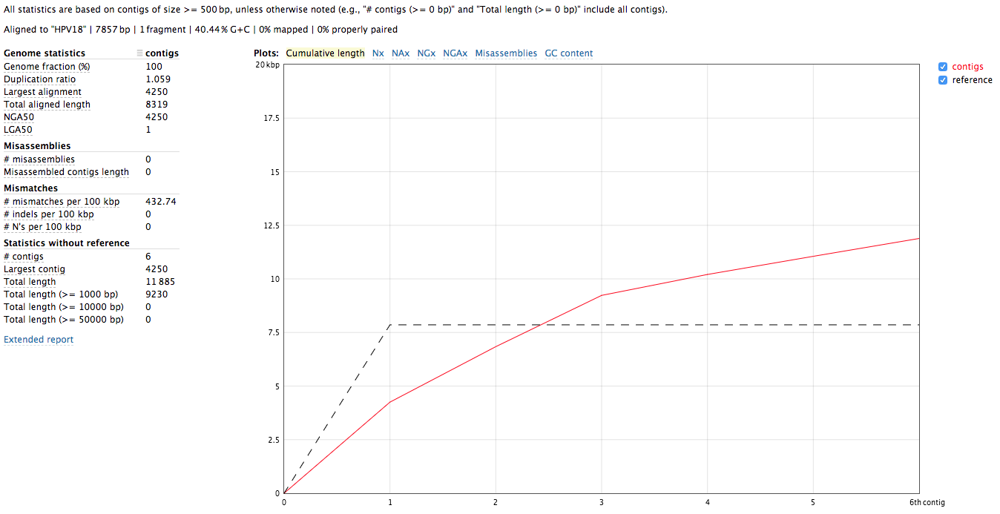
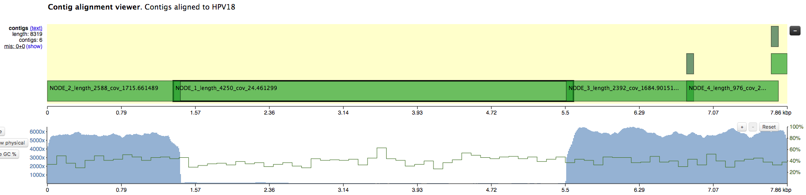
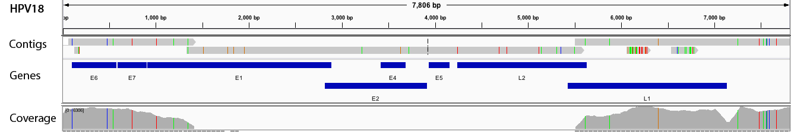

# Oncoviral integration in cervical never-responder

A patient with a possible very atypical cervical carcinoma has not responded to any standard therapies. There were no obvious oncogenic drivers, however the whole genome NGS analysis showed possible HPV content, which is [strongly associated with cervical carcinoma](http://www.who.int/mediacentre/factsheets/fs380/en/). Here we explore the viral sequences in genomic data and their oncogenicity. This readme contains a summary for the findings. For technical notes with commands, see [NeverResponder_with_commands.md](https://github.com/umccr/oncoviruses/blob/master/NeverResponder_with_commands.md).


## Exploring taxonomic content

We performed whole genome sequencing at ~80x depth of coverage on average, and aligned the reads to the human genome build GRCh37 with BWA-MEM, using the bcbio-nextgen analysis workflow.

Oncoviruses like HPV usually cause malignancies by integrating into host's DNA, and in NGS alignment data they appear as structural variations with novel sequences supposedly supported by unmapped reads. Such novel insertions cannot be reconstructed only by read alignment because of the viral parts that do not belong to the reference. Thus, as a next step we extracted the reads unaligned to the human genome, and additionally added the reads with unmapped mates that can possibly point to the integration breakpoints.

Then we queried the target reads against a database of oncoviruses, acquired from [Genomics Data Commons](https://gdc.cancer.gov/about-data/data-harmonization-and-generation/gdc-reference-files). We've done that by mapping selected reads with BWA-MEM against those viral sequences, and selecting those with high read support. Specifically, we select sequences with the highest coverage completeness at 5x of depth. Some viral sequences contain repetitive regions that attract lots of reads, so we wanted to make sure that the enough percentage of the viral sequence is covered.

In this sample, the only one confidently detected oncovirus is HPV18, which is the second most oncogenic HPV type:

```                       completeness at coverage
name     len   mean depth   1x    5x   25x
HPV18  7857bp  2265x      100%  100%   93%
```

## De novo assembly of HPV18

We used the unmapped reads to feed them into a de novo genome assembler SPAdes. Resulting contigs we aligned back to the reference and analysed with QUAST. Reads getting assembled pretty well into 4 long contigs (NODE 1 through 4):





All 4 contigs together evenly cover the whole reference sequence. NODE\_2, NODE\_3 and NODE\_4 are amplified heavily up to 5kX coverage, and NODE\_1 has a significantly lower coverage. The genome is clearly circular - NODE\_2 spans the edges, and the breakpoint supported by discordant pairs as evident in IGV:


The fact that all contigs overlap slightly but were not merged together into single long contig, suggests that there were possible structural rearrangements, probably due to the human genome integration.


## Seeking integration sites

To identify if the virus was integrated into human, we find the reads that map to the virus and have mates mapping to the human genome. We would expect reads of forward orientation to pile up to the left of the breakpoint, and reads of the opposite orientation to pile up to the right of the breakpoint; a symmetrical picture would be expected on the human chromosome as well. In order to visualise it in IGV, we made a "chimeric" reference genome by adding HPV18 as another chromosome into GRCh37, and remapped the viral reads against this assembly.

Below is the HPV18 region in IGV with reads grouped by the mate chromosome (based on [the color scheme](https://software.broadinstitute.org/software/igv/interpreting_insert_size), the small green group is from chromosome 3, the large purple group is from the chromosome 8, and all gray read pairs are entirely mapped to HPV18). The read direction is annotated with blue arrows.


There is a quite evident support for human genome integration to chromosome 8 (tree breakpoints with purple read), and a smaller support for the chromosome 3 integration with the green reads. All reads in each colored pile have the same direction, and their mates symmetrically cluster in GRCh37.

The leftmost purple reads mates (bp1) are mapping mapping to 8:128,303,800-128,304,900. The second rightmost purple pile in the beginning of NODE\_3 (bp2) has its mates mapping 16kb apart downstream: to 8:128,319,000-128,321,000. The mates of the rightmost purple pile (bp3)  map 3kb downstream from bp1 - to 8:128,307,000-128,308,000.


This suggests that the deeply covered 4kb part of the virus containing contigs NODE\_2–NODE\_3–NODE\_4 was inserted into the chromosome 8.


## Integration model

The read orientations spanning the breakpoints suggest a more complex event rather than a simple insertion of a part of the virus. Exploring the full 16kb GRCh37 region covering all 3 breakpoints, we can see that 2 of the breakpoint positions show up very clearly, and it's also evident that:

- The NODE\_2–NODE\_3–NODE\_4 region is amplified heavily instead of being deleted, meaning that the virus didn't just replace the region with itself, resulting in some more complex event;

- The read orientations tell us that the viral amplified region got attached to the rightmost chromosome 8 breakpoint (bp2) from the right side, and to the left breakpoints (bp1 and bp3) from the left side, which rejects the idea of a simple insertion;

- The chromosome 8 region between the breakpoints is heavily amplified, at roughly the same coverage as the viral amplified region.

A kind of integration model that will explain the data would be as follows. The virus created a loop by attaching to bp1 and bp2, and this loop went around multiple times heavily amplifying the chromosome 8 16kb region, as well as the 4kb viral region NODE\_2–NODE\_3–NODE\_4. While looping, it has also likely occasionally got attached to the inner left breakpoint instead bp3 of the leftmost one. Indeed, things like this are typical for HPV viruses, e.g. see [Akagi et al.](https://www.ncbi.nlm.nih.gov/pmc/articles/PMC3912410/figure/F4/). Such regular concatemers composed of viral and host sequences, adjoined by identical HPV-breakpoint sequences, may have accumulated as a result of DNA replication originating from the viral origin of replication. 

In our case, the integration events might have led to the following sequence (regions A, B, C, D are parts of the human reference according to the IGV screenshot in the beginning of the section):


## HPV18 genes

Papillomavirus genome can be divided into three regions: an early region that encodes six common ORFs E1, E2, E4, E5, E6 and E7, a late region coding ORFs L1 and L2, and a long control region that holds the origin of replication and transcription factor binding sites [[Williams et al.](https://www.ncbi.nlm.nih.gov/pmc/articles/PMC3037184/)]. 


Two viral oncoproteins, E6 and E7 are attributed with the ability of evading the immune system and using the host cell replication machinery to survive [[Scheurer et al.](https://onlinelibrary.wiley.com/doi/abs/10.1111/j.1525-1438.2005.00246.x)]. Those genes inactivate two tumor suppressor proteins, p53 (by E6) and pRb family (by E7) [[Chaturvedi et al.](https://link.springer.com/chapter/10.1007%2F978-1-4419-1472-9_5)], and are mainly associated with malignancies.

High levels of E2 down-regulate the early promoter activity, and thus enhances E6 and E7 transcription [[Mcbride et al.](https://www.researchgate.net/figure/HPV18-genome-The-circular-dsDNA-genome-of-HPV18-7-857-bp-is-shown-Viral-open-reading_fig1_236977461)]. For tumor to progress, viral oncogene expression must remain consistently high [[Higgins et al](https://www.ncbi.nlm.nih.gov/pubmed/1322961)], and it usually occurs due to integration of truncated viral genomes with missing or disrupted E2 [[Scheurer et al.](https://onlinelibrary.wiley.com/doi/abs/10.1111/j.1525-1438.2005.00246.x)]. This event is not a normal part of the viral lifecycle, as it is accompanied by the loss of other viral genes needed for synthesis of an infectious virion [[Williams et al.](https://www.ncbi.nlm.nih.gov/pmc/articles/PMC3037184/)]. The degree to which E6 and E7 are expressed is correlated with the type of cervical lesion that can ultimately develop [[Bernard et al.](https://www.ncbi.nlm.nih.gov/pmc/articles/PMC251048/)].

By overlaying [HPV18 genes](https://www.ncbi.nlm.nih.gov/gene/1489088) on coverage, we can see that E6 and E7 are indeed amplified heavily:



And even though the integration breakpoints site didn't disrupt E2, that gene was apparently not the part of the virus that was integrated into human genome, has a low coverage and likely under-expressed.


## Host genes

The chromosome 8 integration site overlaps long non-coding RNA genes CASC21 (Cancer Susceptibility 21, CARLo-2) and CASC8 (Cancer Susceptibility 8, CARLo-1) in their introns. Both genes are associated with cancer, and located in a region 8q24.21 nearby the oncogene MYC.

The 8q24.21 location is well known as an HPV integration site hotspot in genital cancers [[Doolittle-Hall et al.](https://www.ncbi.nlm.nih.gov/pmc/articles/PMC4695887), [Ferber et al.](https://www.nature.com/articles/1207006)]. It has a very strong association with adjacent genomic amplifications and rearrangements [[Akagi et al](https://www.ncbi.nlm.nih.gov/pmc/articles/PMC3912410/)], and plays a part in tumor progression via an activation of cellular oncogenes. In particular, 8q24.21 integration is in most cases associated with alteration or over-expression of nearby located oncogene MYC [[Couturier et al.](https://www.ncbi.nlm.nih.gov/pubmed/1649348/)]. We indeed observe a focal MYC amplification in the patient's data. 

However, the relationship of the virus to such regional structural abnormalities, their detailed genomic structures and their functional significance remain largely unknown [[Akagi et al](https://www.ncbi.nlm.nih.gov/pmc/articles/PMC3912410/)]. 


## Further work directions

1. It would be very interesting to perform RNAseq on this sample and quantify the expression of viral E6, E7, E2; as well as human MYC, TP53, and RB1. Additionally, MYC significantly up-regulates genes with already high expression, so it would be interesting to look for other over-expressed genes.

2. There are HPV18 reads (colored moss green on the IGV screenshot) which mates consistently map to 3:186,691,636-186,699,490 region of the human genome, suggesting another possible integration site. However it's not so clear and occurs in a low covered region.

3. One interesting observation comes from blasting the contigs against all human sequences: it reports 18% coverage in a chromosome 8 alternative assembly, and same 18% in hg38. It would be interesting to perform the same experiment with hg38 which likely includes parts of HPV18.


## Processing commands

### Searching for integrating viruses

```
ORI_BAM=/path/to/sample-ready.bam
PFX=sample
```

Extracting all unmapped reads, as well as mapped reads with unmapped mate, that could confirm integration:

```
sambamba view -f bam -F "unmapped or mate_is_unmapped" -t 30 $ORI_BAM | samtools sort -n -@ 30 > $PFX.unmapped_or_mate.bam
 
# filter out bad fastq and alignments
./filter_bam_good_unmapped_or_mate.py $PFX.unmapped_or_mate.bam $PFX.unmapped_or_mate.lng_hqual.bam

# convert to paired fastq
samtools fastq $PFX.unmapped_or_mate.lng_hqual.bam -1 $PFX.unmapped_or_mate.R1.fq -2 $PFX.unmapped_or_mate.R2.fq -s $PFX.unmapped_or_mate.single.fq
```

Getting reads mapping to the GDC database of oncoviral sequences:

```
mkdir $PFX_viral_mapping
bwa mem -t 30 human_plus_viral_genome/gdc-viral $PFX.unmapped_or_mate.R1.fq $PFX.unmapped_or_mate.R2.fq | bamsort inputthreads=30 outputthreads=30 inputformat=sam index=1 indexfilename=$PFX_viral_mapping/to_gdc.bam.bai O=$PFX_viral_mapping/to_gdc.bam
```

Viewing read mapping statistics:

```
bash check_cov.sh $PFX_viral_mapping/to_gdc.bam
tsv viral_mapping/$PFX_to_gdc-completeness.txt
```


### Integration sites

Getting reads mapping to the virus

```
VIRUS=HPV17

# get the virus sequence
samtools faidx human_plus_viral_genome/gdc-viral.fa $VIRUS > $PFX_viral_mapping/$VIRUS.fa
bwa index $PFX_viral_mapping/$VIRUS.fa

# align to the virus
bwa mem -t 30 $PFX_viral_mapping/$VIRUS.fa $PFX_unmapped_or_mate.R1.fq $PFX_unmapped_or_mate.R2.fq | bamsort inputthreads=30 outputthreads=30 inputformat=sam index=1 indexfilename=$PFX_viral_mapping/to_$VIRUS.bam.bai O=$PFX_viral_mapping/to_$VIRUS.bam
```

Getting reads that map to the CMV with one mate:

```
cd $PFX_viral_mapping
samtools view to_$VIRUS.bam $VIRUS -o to_$VIRUS.mapped_or_mate.bam

samtools sort -n to_$VIRUS.mapped_or_mate.bam -O bam -o to_$VIRUS.mapped_or_mate.namesorted.bam

samtools fastq to_$VIRUS.mapped_or_mate.namesorted.bam -1 to_$VIRUS.mapped_or_mate.R1.fq -2 to_$VIRUS.mapped_or_mate.R2.fq -s to_$VIRUS.mapped_or_mate.single.fq
```

To explore integration sites, remapping to human+virus database:

```
minimap2 -ax sr ../human_plus_viral_genome/human_gdc-viral.fa to_$VIRUS.mapped_or_mate.R1.fq to_$VIRUS.mapped_or_mate.R2.fq | bamsort inputformat=sam index=1 indexfilename=to_human_$VIRUS.bam.bai O=to_human_$VIRUS.bam
```

Exploring in IGV with `/data/cephfs/punim0010/extras/vlad/synced/HGT-ID/resources/human_gdc-viral.fa` reference.
